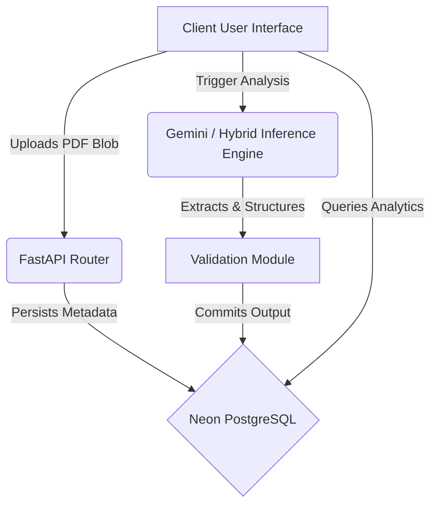

# AI Budget Transparency Platform

> Live Production Environment: [https://proj2-omega.vercel.app/dashboard](https://proj2-omega.vercel.app/dashboard)

## Architecture Overview

This platform implements a distributed, hybrid machine learning service designed to extract structured fiscal intelligence from raw, unstructured County Budget Implementation Review Reports (CBIRR). It operates using a bifurcated architectural design:

1.  **Frontend Interface (Vercel Serverless Application):** Built on Next.js 14 (App Router) using React Server Components, customized UI tokens, and dynamic fetching.
2.  **Machine Learning Operations Backend (Render API Instance):** A high-performance FastAPI Python application responsible for document orchestration, NLP inference, and scheduled data extraction.
3.  **PostgreSQL Data Sink (Neon Serverless):** Centralized Relational Database handling state, user roles, file metadata, and analysis blobs.

## Core Security Implementations

*   **Strict CORS Policy:** The Python backend is explicitly restricted to accept requests originating only from verified Vercel origins (`https://proj2-omega.vercel.app`), mitigating Cross-Site Request Forgery (CSRF). 
*   **Next.js Security Headers:** HTTP response headers enforce strict policies, including `Strict-Transport-Security` (max-age 63072000), `X-Frame-Options` (Clickjacking prevention), and `X-Content-Type-Options` (MIME sniffing prevention).
*   **Offloaded Payload processing:** Implemented dual-upload streams bypassing serverless memory limits, pushing raw unverified blobs directly to Python isolation containers instead of passing them through the Edge Nodes.
*   **Sanitized Generative API Parameters:** The AI models process text streams rather than executing commands, keeping the LLM strictly within boundary inference.

## Primary System Workflows

### Module Breakdown:

**1. Inference Engines (`/app/python_service/ai_models`)**
The application supports multiple extraction strategies. The primary engine utilizes `gemini-2.5-flash` natively to run zero-shot instruction parsing over multi-page PDF binaries, bypassing heavy classical OCR techniques for performance yields of `< 4500ms` per document.

**2. Asynchronous Daily Merits (`/app/python_service/hot_take_extractor.py`)**
A system cron job configured via `APScheduler` initiates at `03:00 AM UTC` everyday. It scans database deltas and triggers the Inference Pipeline to generate global aggregate insights, economic tickers, and cross-county analysis without manual intervention.

**3. Next.js Static Cache Bypassing**
To prevent Next.js from aggressively caching the API layer, all data ingestion paths (dashboard metrics, report generations, user settings) enforce `export const dynamic = "force-dynamic"`, ensuring the React DOM hydration aligns perfectly with real-time PostgreSQL states.

## Database Schema Model
The system uses the following relational mappings (PostgreSQL):
*   `uploads` - High level BLOB pointer and operational state tracking
*   `analysis_results` - Semi-structured JSON fields holding the parsed financial markers from the inference engines
*   `user_roles` - RBAC mapping for Admins and Dashboard Users
*   `system_settings` - Global macro constants (i.e. Global Budget Target Constants)

## Initial Deployment Checklist

If re-deploying this monolithic service to new node instances:

1. Deploy the `NextJS` frontend and supply:
   - `NEXT_PUBLIC_BACKEND_API_URL`
2. Deploy the `Python FastApi` module and supply:
   - `DATABASE_URL` (Postgres schema URL)
   - `GOOGLE_API_KEY` (Gemini API access)
   - Disable automatic sleep mode for `cron` background workers to function correctly.

---
*Authorized for internal development and review only.*
